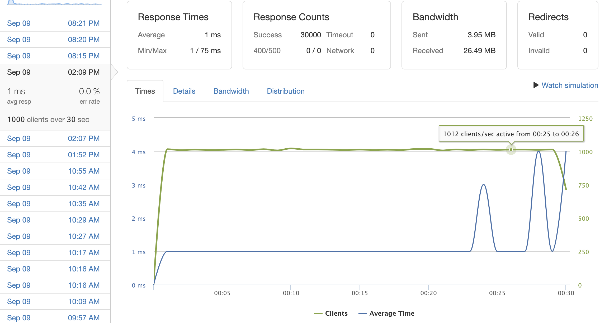
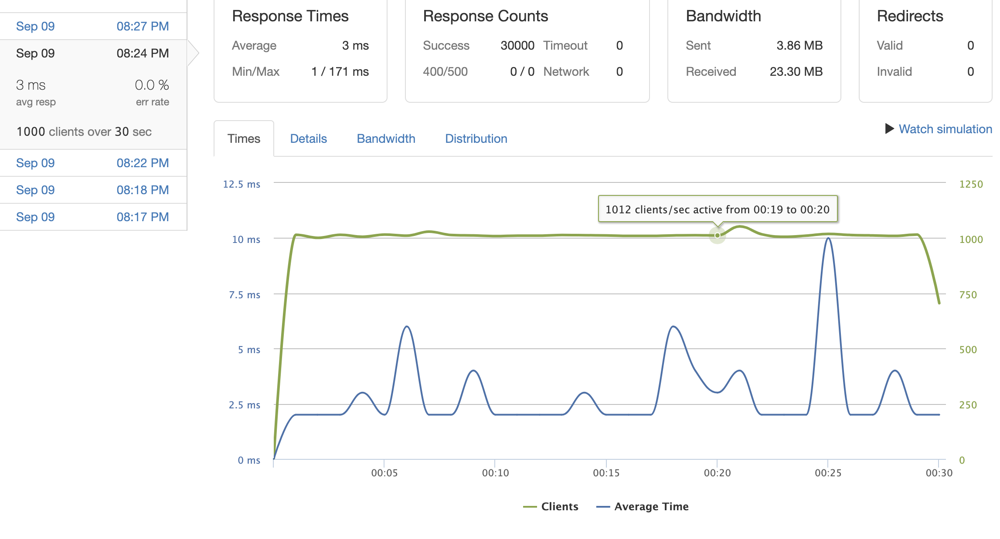
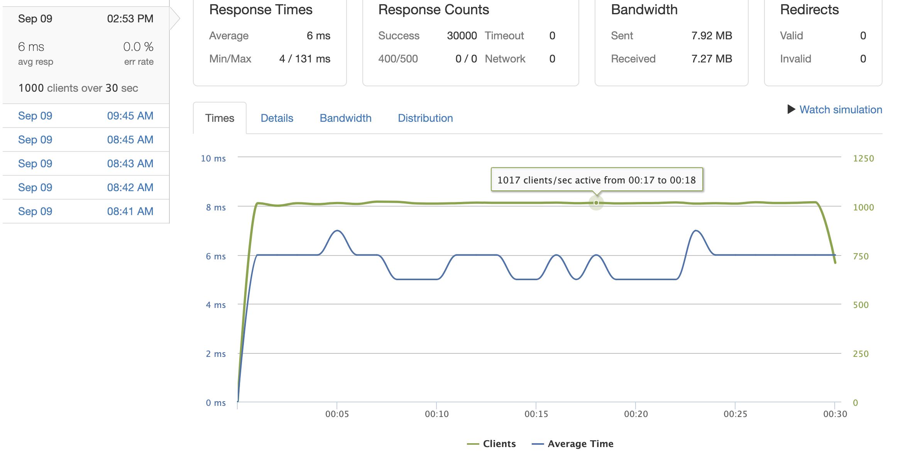
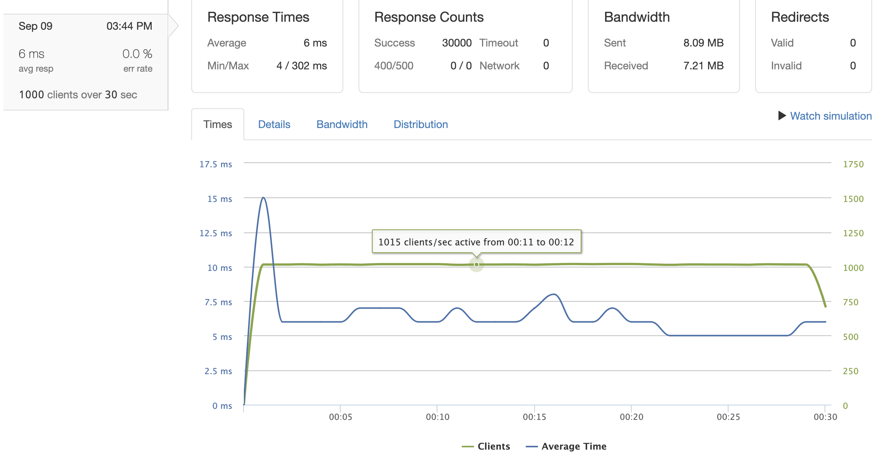
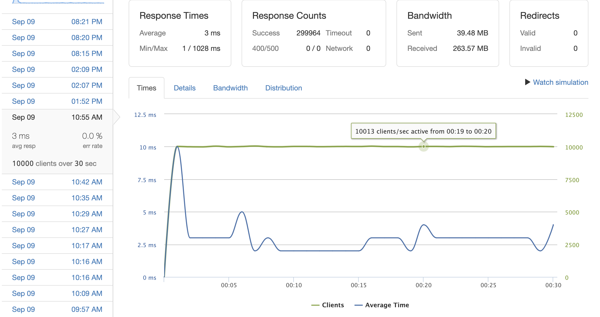

# System Design for Questions And Answers Service

Table of Contents
- [Description](#description)
- [Author](#author)
- [Built With](#built-with)
- [Project Overview & Demos](#project-overview--demos)

 ## Description
To revamp the existing Questions and Answers service on the e-commerce platform, enhancing its capabilities, scalability, and efficiency.

## Authors

- [**Eric Chang**](https://github.com/ESC8504)

## Built With

- 
- 
- 
- 
- 
- 
- 
- 
- 

## Project Overview & Demos

In this project, I replaced the existing API with a backend system that can support the project's full data set and scale to meet the demands of production traffic. I ensured that the backend system was optimized for scalability to guarantee reliable performance, even during high-traffic periods. It was essential to ensure that our system not only supported the current user base but was also future-proofed to anticipate and accommodate significant user growth. The e-commerce platform is now better equipped to handle user queries efficiently, even as the platform's user base expands exponentially.

### Random product_id GET Questions and GET answers

Scaled to 1000 requests per second for random sampling and bias selection for records within the last 10% of the dataset, which contains 100,000 records.
The average response time is less than 3ms, and the error rate is 0%.
Optimizations: PostgreSQL indexing, load balancer with 4 AWS EC2 servers running
   qa/questions?product_id=%{*:900000-1000000} || 1000 requests per second || 1ms 0% error rate
   {:height="200px" width="400px"}
   qa/questions/%{*:900000-1000000}/answers || 1000 requests per second || 3ms 0% error rate
   {:height="200px" width="400px"}

### Random questions_id POST Questions and POST answers

Scaled to 1000 requests per second for random sampling and bias selection for records within the last 10% of the dataset, which contains 100,000 records.
The average response time is less than 6ms, and the error rate is 0%.
Optimizations: PostgreSQL indexing, load balancer with 4 AWS EC2 servers running
   qa/questions || 1000 requests per second || 6ms 0% error rate
   {:height="200px" width="400px"}
   qa/questions/%{*:1-100000}/answers || 1000 requests per second || 6ms 0% error rate
   {:height="200px" width="400px"}

### Repeating product_id GET

Scaled to 10k requests per second for records within the newest 100 product_id in the dataset.
The average response time is less than 3ms, and the error rate is 0%.
Optimizations: PostgreSQL indexing, load balancer with 4 AWS EC2 servers running, NGINX Content Caching.
   qa/questions?product_id=%{*:999900-1000000}
   {:height="200px" width="400px"}

